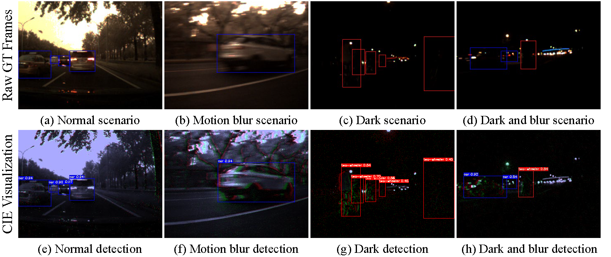

# Multimodal Detection Transformer

## Conda Installation
We use the environment same to [DINO-DETR](https://github.com/IDEA-Research/DINO), other versions might be available as well.  We test our models under`python=3.7,pytorch=1.9.1,cuda=11.1`. 

1.  Install Pytorch and torchvision.
Follow the instruction on  [https://pytorch.org/get-started/locally/](https://pytorch.org/get-started/locally/).

`conda install -c pytorch pytorch torchvision`

2.  Compiling CUDA operators
   
`cd models/EDT/ops`

`python setup.py build install`

# Demo
1. We have put our model checkpoints here[MMDT-B: Goole Drive](https://drive.google.com/drive/folders/1No0boN0nJoMdMr0ykOCXAWXaT6_Pu_I_).

2. Please download weights and organize them as following:

weights/

&emsp;  ├── detect/

&emsp;  ├── events/

&emsp;  ├── images/

&emsp;  ├── checkpoing0011.pth

3.  Run detect.py and the prediction results in `weights/detect/`.
